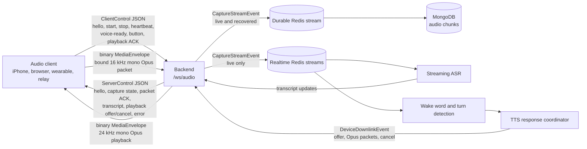

# Chronicle Audio V2 — current protocol

Chronicle has one audio WebSocket: `/ws/audio`. The client must request the
`chronicle.audio.v2` subprotocol.

The audio protocol does only five jobs:

1. identify and authenticate an audio client;
2. start and stop a capture;
3. carry audio packets;
4. return packet acknowledgements and live transcript text; and
5. offer, stream, cancel, and acknowledge assistant audio playback.

It is not a general phone-command or notification channel.

## Diagram

## What crosses each boundary

### WebSocket control messages

Control messages are generated Protobuf messages encoded as JSON.

- Client to server: `ClientHello`, `StartCapture`, `StopCapture`, `VoiceReady`,
  `PlaybackAcknowledgement`, `Heartbeat`, and `ButtonEvent`.
- Server to client: `ServerHello`, `CaptureStarted`, `CaptureStopped`,
  `CapturePacketAccepted`, `TranscriptUpdate`, `PlaybackOffer`,
  `CancelPlayback`, `Heartbeat`, and `ProtocolError`.

The first client message must be `ClientHello`. It carries the bearer token, source
identity, device kind, display name, and supported audio formats.

### WebSocket audio messages

Audio uses binary `MediaEnvelope` messages.

- Uplink is raw Opus: 16 kHz, mono, one 20 ms packet per envelope.
- Downlink playback is raw Opus: 24 kHz, mono.
- Every capture packet carries its capture binding, sequence number, absolute capture
  time, monotonic offset, delivery class, and Opus bytes.
- PCM never crosses the public WebSocket.

### Capture binding

A capture binding contains the capture-session ID, optional voice-session ID, and
capture epoch. The backend rejects media from the wrong session or epoch. This stops
late packets from an old socket being accepted into a replacement session.

### Redis after ingress

The backend decodes Opus to canonical 16 kHz mono PCM and publishes generated
`CaptureStreamEvent` messages.

- The durable lane receives live and recovered packets and persists canonical Opus
  chunks in MongoDB.
- The realtime lane receives live packets only and feeds streaming transcription,
  wake-word detection, and turn detection.
- Recovered audio never triggers a live wake word or action.

Assistant playback returns through generated `DeviceDownlinkEvent` messages. That
contract contains only playback offers, playback packets, and cancellation.

## Source of truth

- Wire schema: `contracts/audio/v2/proto/backend/audio_contract/v2/audio.proto`
- Backend adapter: `backend/src/backend/controllers/audio_v2_controller.py`
- Mobile adapter: `app/src/protocol/audioV2Socket.ts`
- Browser adapter: `backend/webui/src/protocol/webAudioV2Session.ts`

Generated Python and TypeScript files are derived from the `.proto` file. Change the
schema first, then run `scripts/generate-audio-contracts.sh`.
