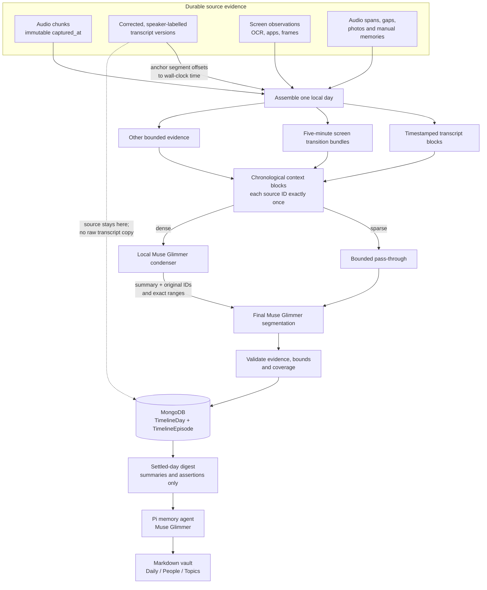

# Memory segmentation and storage

This is the canonical pipeline for turning a local day of multimodal capture into
semantic timeline episodes and durable memory. It deliberately separates **source
evidence**, **derived timeline structure**, and **curated vault memory**. A capture
chunk is not an episode, and an episode is not automatically a memory.

> **Storage invariant:** the timeline/day-memory path never copies raw transcripts or
> deterministic `Episodes/*.md` notes into the vault. Corrected transcripts remain in
> MongoDB as source evidence. MongoDB stores the revisioned episode ledger; the vault
> receives only bounded episode summaries and grounded assertions selected by the
> memory agent.

## 1. Durable inputs

The broker assembles evidence inside one IANA-local calendar day:

- active corrected transcript versions, including speaker labels;
- audio chunks and audio profiles;
- ScreenPipe observations, OCR/accessibility text, applications and frame references;
- capture gaps, meetings, Immich candidates, images and deliberate manual memories.

`AudioChunkDocument.captured_at` is the recording's immutable wall-clock identity.
`conversation_id` and relative offsets can change after split, merge or trimming, so
they must not be used as the absolute timestamp. Transcript segment offsets are placed
on the wall clock through the conversation's chunk-anchor map.

The resulting evidence manifest has an `evidence_revision` derived from evidence IDs,
bounds, content hashes, excerpts and semantic metadata. This makes the exact source
revision cacheable and auditable.

## 2. Deterministic evidence shaping

Before any agent decides episode boundaries, Chronicle makes the input bounded without
pretending that transport boundaries are semantic boundaries.

### Transcript blocks

Transcript segments are kept in time order and split when any of these limits is hit:

- a silence gap greater than 90 seconds;
- a block duration greater than five minutes;
- approximately 6,000 characters of speaker-attributed text.

This gives the segmenter real internal cut points. A 73-minute recording is no longer
one indivisible evidence item, while the final agent remains free to merge adjacent
blocks into one coherent episode.

### Screen compaction

Screen observations are deterministically grouped into five-minute transition bundles.
Each bundle keeps the original observation IDs and time range, samples up to ten first
and last transitions, and bounds verbose OCR/accessibility text. This is transport
compaction, not event detection: the agent still decides whether a screen change is a
new activity or part of the same one.

Coverage windows remain useful for completeness validation, but empty windows are
discarded and overlapping windows are not given to the agent as repeated input.

## 3. Hierarchical agent context

Chronicle assigns every original evidence ID exactly once to chronological context
blocks. Current defaults are at most 80,000 serialized characters or 160 compact
groups per block.

A block is dense at 50,000 characters or 80 original evidence items. Dense blocks get
a separate single-pass local Pi + Muse Glimmer condensation with thinking disabled and
a 12,000-token ceiling. The useful result is already capped to twelve short events, so
reasoning tokens only reduce its output headroom. The bounded JSON is supplied directly,
without a file-reading tool loop. Sparse blocks pass through without a model call. A
malformed condenser response is retained as a non-reusable diagnostic artifact and gets
one stricter local JSON retry; a successful result is persisted and reused.

The condenser returns temporal events with summaries, entities, modalities, exact
ranges and original evidence IDs. Deterministic repair then:

1. removes invented evidence IDs;
2. restores omitted or unresolved source IDs in chronological bundles capped at eight
   fallback events per context block;
3. splits even model-authored condenser events at real evidence gaps and re-anchors
   each repaired event to the exact bounds of its own source groups;
4. preserves the original source count;
5. retains up to eight first, last or image citations per event for boundary support.

Fallback repair is chronological and gap-safe. One fallback event may not bridge more
than five minutes without evidence or span more than one hour. The event-count target
is therefore soft: when satisfying it would fabricate continuity across a long empty
interval, Chronicle keeps another bounded event instead.

Before final transport, each context block is capped at sixteen temporal events. This
also bounds older cached condensations created before fallback repair was compacted,
while every original evidence ID remains attached to a transported event. The final Pi
and Muse Glimmer pass receives the complete ordered compact context directly and returns
schema JSON without a file-tool loop. It uses low thinking and a 32,000-token ceiling.
Malformed or truncated JSON is retained as a non-reusable diagnostic artifact and gets
up to two stricter local retries, without rebuilding context. Validation failures move
through low, medium, then high reasoning so a structurally bad low-effort draft cannot
silently settle a day. Each higher-effort attempt receives the deterministic validator's
exact rejection, rather than repeating the same prompt blind. It can merge or split
across blocks and returns open-vocabulary episodes rather than inheriting transcript,
ScreenPipe or context-block boundaries.

## 4. Validation and publication

Agent output is proposed structure, never authoritative source data. Before publishing,
Chronicle verifies that:

- every cited evidence ID exists in the manifest;
- each episode has a positive duration inside the local day;
- citations overlap the proposed episode and support its boundaries;
- an episode does not bridge more than fifteen minutes in which the assembled manifest
  contains no evidence;
- evidence is accounted for by an episode, a pinned interval or an explicit unassigned
  interval;
- malformed episodes are dropped individually, and a non-empty day cannot publish an
  unexplained empty generation.

Publication is generation-based. All `TimelineEpisode` rows are inserted before
`TimelineDay.active_run_id` changes, so a failed run cannot expose a partial day. The
ledger keeps evidence references, semantic bounds and authoritative `audio_ranges`;
older generations remain available for audit. A conversational episode carries its own
immutable playable audio ranges and can link to the live Conversation claims that
supplied them. Conversation materialization happens in the deliberate-upload or
speech-detection path, not as a side effect of Timeline or vault publication; no hidden
capture container is promoted into a semantic recording here.

Replacing an existing generation has an additional captured-time guard. If a proposed
run adds both more than five minutes and more than ten percent of unexplained captured
time compared with the active run, publication fails with
`TimelineCoverageRegression`; the previous generation stays active. Publishing a valid
new generation clears that day's memory latch so the settled-day writer reconciles the
vault with the new active episode set.

## 5. Vault write boundary

Only a settled, past day is eligible for a vault write. Chronicle builds one bounded
digest from the active episodes containing:

- title, time range, kind, salience and summary;
- entities and structured attributes;
- assertions annotated with role and confidence.

The digest contains no raw transcript, OCR dump or evidence payload. If it exceeds its
budget, low-salience non-conversational summaries are removed first; conversational
summaries are retained. Before invoking the model, Chronicle installs a deterministic,
concise `Daily/<date>.md` episode index: exact time range, kind, salience and title only.
Detailed summaries stay on `TimelineEpisode`. The memory agent does not rewrite that
index; it decides only which genuinely durable facts deserve a `People/`, `Topics/` or
other category edit. `TimelineDay.memory_state` is the write-once latch for that
generation workflow.

The vault owner's Person note is not another chronological index. Routine statements,
work, builds and tests are already visible in the Daily index and do not produce dated
self-mentions. The owner note changes only for durable identity, relationship,
preference, constraint, responsibility or long-lived-goal facts. Day writes cannot
modify `People/*` Mentions for anyone; a durable relationship or role belongs in About,
while every dated appearance remains in Daily/Timeline. Topic notes require recurring
or durable cross-day state rather than a one-off phrase or implementation event, and a
new Topic is rejected when most of its facts already belong to one existing peer.

Reanalysis replaces the Daily note's complete `## Episodes` section mechanically; it
never appends only the changed episodes. Verification requires exactly one chronological
bullet for every active episode and its exact `HH:MM–HH:MM` source range. A missing,
stale or extra range is bad data and fails the write. Installing the index before the
agent prevents large days from spending output tokens copying summaries and leaves the
model's tool budget for cross-day semantic memory. Memory claims and completion updates
are also bound to the active run ID: if a newer timeline generation publishes while an
agent is writing, the stale write is reported as superseded and cannot mark the new
generation written.

This boundary avoids three forms of corruption: duplicating the corpus into Markdown,
turning arbitrary capture chunks into permanent memories, and letting a segmentation
mistake become an apparently authoritative user fact.

## 6. Caching, tracing and rebuilds

Context condensations use the `pi_timeline_context` cache and final segmentation uses
`pi_timeline`. Cache identity includes the evidence revision, model settings, context
version and workspace fingerprints. Changing evidence or the shaping algorithm cannot
silently reuse a stale result.

When Langfuse is configured, both the condensation and final Pi model calls are traced
with stage, model, latency, usage, block counts and completion state. This lets local
Muse Glimmer runs be compared with Codex runs without changing the storage contract.

For a segmentation or day-memory change, the `days` rebuild stage is the safe replay
point: it preserves source audio and the corrected speaker layer, clears only derived
timeline/vault state and the memory audit latch, processes days chronologically, then
verifies the rebuilt vault. Day and repair jobs are scoped to one rebuild run, and a
new rebuild refuses to clear state while any queued job can still mutate the same
user's Timeline or vault. Use `timeline` only when audio bounds or diarization must also
be recomputed. Always take and verify a backup before clearing derived state.

## Correctness invariants

- Source audio and corrected transcripts are never deleted by a memory rebuild.
- Absolute transcript time comes from immutable chunk capture anchors.
- Every source evidence ID enters hierarchical context exactly once.
- Agent summaries may compress evidence, but may not invent or lose evidence identity.
- Context fallback may not manufacture continuity across long evidence gaps, and a
  published episode may not bridge a manifest gap longer than fifteen minutes.
- Episode boundaries are semantic decisions; storage/transport boundaries are only
  evidence.
- MongoDB owns revisions, evidence references and audio ranges.
- A replacement generation may not materially regress captured-time coverage.
- A Daily note's episode list exactly matches the active generation and its ranges.
- A superseded memory worker cannot complete the newly active generation's latch.
- The timeline/day path writes no raw transcript and no `Episodes/*.md` into the vault.
- Bad or empty agent output is an error, not a healthy successful generation.
